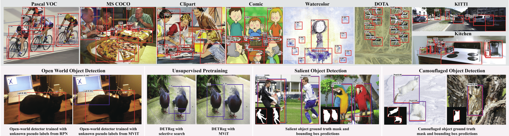
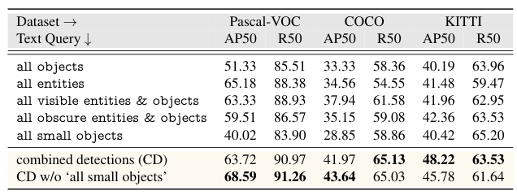
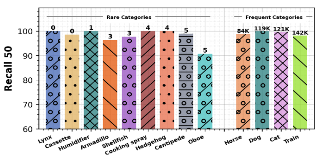
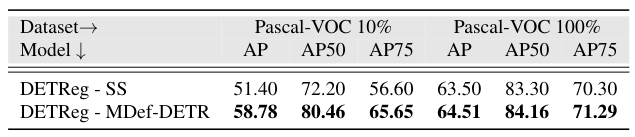

# MViTs Excel at Class-agnostic Object Detection

[](https://paperswithcode.com/sota/class-agnostic-object-detection-on-pascal-voc?p=multi-modal-transformers-excel-at-class)
[](https://paperswithcode.com/sota/class-agnostic-object-detection-on-coco?p=multi-modal-transformers-excel-at-class)
[](https://paperswithcode.com/sota/class-agnostic-object-detection-on-kitti?p=multi-modal-transformers-excel-at-class)
[](https://paperswithcode.com/sota/class-agnostic-object-detection-on-kitchen?p=multi-modal-transformers-excel-at-class)
[](https://paperswithcode.com/sota/class-agnostic-object-detection-on-comic2k?p=multi-modal-transformers-excel-at-class)

[](https://paperswithcode.com/sota/open-world-object-detection-on-pascal-voc?p=multi-modal-transformers-excel-at-class)
[](https://paperswithcode.com/sota/open-world-object-detection-on-coco-2017?p=multi-modal-transformers-excel-at-class)
[](https://paperswithcode.com/sota/open-world-object-detection-on-coco-2017-1?p=multi-modal-transformers-excel-at-class)
[](https://paperswithcode.com/sota/open-world-object-detection-on-coco-2017-2?p=multi-modal-transformers-excel-at-class)

[](https://paperswithcode.com/sota/object-detection-on-pascal-voc-10?p=multi-modal-transformers-excel-at-class)
[](https://paperswithcode.com/sota/object-detection-on-pascal-voc-2007?p=multi-modal-transformers-excel-at-class)

**Multi-modal Vision Transformers Excel at Class-agnostic Object Detection**

[Muhammad Maaz](https://scholar.google.com/citations?user=vTy9Te8AAAAJ&hl=en&authuser=1&oi=sra), [Hanoona Rasheed](https://scholar.google.com/citations?user=yhDdEuEAAAAJ&hl=en&authuser=1&oi=sra), [Salman Khan](https://salman-h-khan.github.io/), [Fahad Shahbaz Khan](https://scholar.google.es/citations?user=zvaeYnUAAAAJ&hl=en), [Rao Muhammad Anwer](https://scholar.google.com/citations?hl=en&authuser=1&user=_KlvMVoAAAAJ) and [Ming-Hsuan Yang](https://scholar.google.com/citations?user=p9-ohHsAAAAJ&hl=en)


****Paper**: https://arxiv.org/abs/2111.11430**

## :rocket: News
* Evaluation code along with pre-trained models & pre-computed predictions is released.

<hr />


> **Abstract:** *What constitutes an object? This has been a long-standing question in computer vision. Towards this goal, numerous learning-free and learning-based approaches have been developed to score objectness. However, they generally do not scale well across new domains and for unseen objects. In this paper, we advocate that existing methods lack a top-down supervision signal governed by human-understandable semantics. To bridge this gap, we explore recent Multi-modal Vision Transformers (MViT) that have been trained with aligned image-text pairs. Our extensive experiments across various domains and novel objects show the state-of-the-art performance of MViTs to localize generic objects in images. Based on these findings, we develop an efficient and flexible MViT architecture using multi-scale feature processing and deformable self-attention that can adaptively generate proposals given a  specific language query. We show the significance of MViT proposals in a diverse range of applications including open-world object detection, salient and camouflage object detection, supervised and self-supervised detection tasks. Further, MViTs offer enhanced interactability with intelligible text queries.* 
<hr />

## Architecture overview of MViTs used in this work


<hr />

## Installation
The code is tested with PyTorch 1.8.0 and CUDA 11.1. After cloning the repository, follow the below steps for installation,

1. Install PyTorch and torchvision
```shell
pip install torch==1.8.0+cu111 torchvision==0.9.0+cu111 -f https://download.pytorch.org/whl/torch_stable.html
```
2. Install other dependencies
```shell
pip install -r requirements.txt
```
3. Compile Deformable Attention modules
```shell
cd models/ops
sh make.sh
```
<hr />

## Results
<hr />

<strong>Class-agnostic OD performance of MViTs</strong> in comparison with uni-modal detector (RetinaNet) on several datasets. MViTs show consistently good results on all datasets.


<hr />

<strong> Enhanced Interactability</strong>: Effect of using different <strong>intuitive text queries</strong> on the MDef-DETR class-agnostic OD performance.
Combining detections from multiple queries captures varying aspects of objectness.



<hr />

<strong> Language Skeleton/Structure</strong>: Experimental analysis to explore the contribution of language by removing all textual inputs, but maintaining the structure introduced by captions. 
All experiments are performed on Def-DETR. 
In setting 1, annotations corresponding to same images are combined. 
Setting 2 has an additional NMS applied to remove duplicate boxes. 
In setting 3, four to eight boxes are randomly grouped in each iteration. 
The same model is trained longer in setting 4. 
In setting 5, the dataloader structure corresponding to captions is kept intact. 
Results from setting 5 demonstrate the importance of structure introduced by language.


<hr />

<strong> Generalization to Rare/Novel Classes</strong>: MDef-DETR class-agnostic OD performance on rarely and frequently occurring categories in the pretraining captions.
The numbers on top of the bars indicate occurrences of the corresponding category in the training dataset.
The MViT achieves good recall values even for the classes with no or very few occurrences.



<hr />
<strong> Open-world Object Detection</strong>: Effect of using class-agnostic OD proposals from MDef-DETR for pseudo labelling of unknowns in Open World Detector (ORE).


<hr />
<strong> Pretraining for Class-aware Object Detection</strong>: Effect of using MDef-DETR proposals for pre-training of DETReg instead of Selective Search proposals.


<hr />

## Evaluation
The dataset, pretrained models and pre-computed predictions are available at [this link](https://shortest.link/1Rka).
Download the datasets (annotations & images) and arrange them as,
```
code_root/
└─ data
    └─ voc2007
        ├─ Annotations
        ├─ JPEGImages
    └─ coco
        ├─ instances_val2017.json
        ├─ val2017
    └─ kitti
        ├─ Annotations
        ├─ JPEGImages
    └─ kitchen
        ├─ Annotations
        ├─ JPEGImages
    └─ cliaprt
        ├─ Annotations
        ├─ JPEGImages
    └─ comic
        ├─ Annotations
        ├─ JPEGImages
    └─ watercolor
        ├─ Annotations
        ├─ JPEGImages
    └─ dota
        ├─ Annotations
        ├─ JPEGImages
```

Once the above directory structure is created,
1. Download the pretrained weights from [this link](https://shortest.link/1Rka).
2. Set the environment variable
```shell
export PYTHONPATH="./:$PYTHONPATH"
```
3. Run the following script to generate predictions and calculate metrics.
   1. MDef-DETR
    ```shell
    bash scripts/get_mvit_multi_query_metrics.sh <dataset root dir path> <model checkpoints path> 
    ```
   2. MDef-DETR w/o Language Branch (trained by maintaining the structure introduced by captions)
    ```shell
    bash scripts/get_mvit_minus_language_metrics.sh <dataset root dir path> <model checkpoints path> 
    ```

Alternatively, you can also download the pre-computed predictions from [this link](https://shortest.link/1Rka) 
and run the following scripts to calculate metrics. 
```shell
python evaluation/class_agnostic_od/get_multi_dataset_eval_metrics.py <model name>
```

The calculated evaluation metrics will be stored in a `*.csv` file in the same directory.

<hr />

## Citation
If you use our work, please consider citing:
```bibtex
    @article{Maaz2021Multimodal,
        title={Multi-modal Transformers Excel at Class-agnostic Object Detection},
        author={Muhammad Maaz and Hanoona Rasheed and Salman Khan and Fahad Shahbaz Khan and Rao Muhammad Anwer and Ming-Hsuan Yang},
        journal={ArXiv 2111.11430},
        year={2021}
    }
```

## Contact
Should you have any question, please create an issue on this repository or contact at muhammad.maaz@mbzuai.ac.ae, hanoona.bangalath@mbzuai.ac.ae

