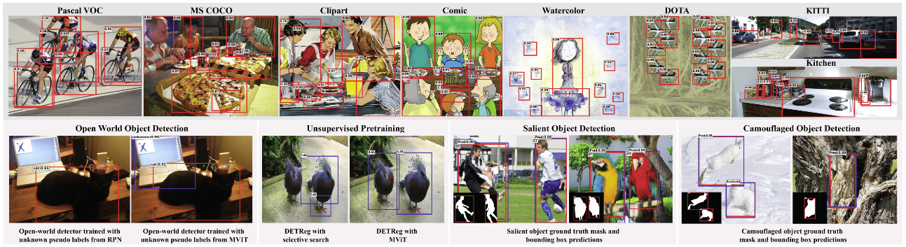
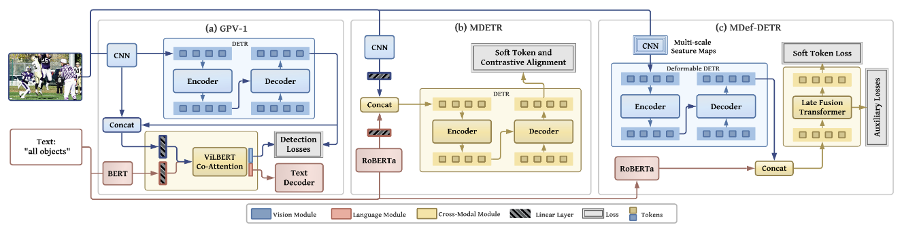

# MViTs Excel at Class-agnostic Object Detection
Multi-modal Vision Transformers Excel at Class-agnostic Object Detection

[Muhammad Maaz](https://scholar.google.com/citations?user=vTy9Te8AAAAJ&hl=en&authuser=1&oi=sra), [Hanoona Rasheed](https://scholar.google.com/citations?user=yhDdEuEAAAAJ&hl=en&authuser=1&oi=sra), [Salman Khan](https://salman-h-khan.github.io/), [Fahad Shahbaz Khan](https://scholar.google.es/citations?user=zvaeYnUAAAAJ&hl=en), [Rao Muhammad Anwer](https://scholar.google.com/citations?hl=en&authuser=1&user=_KlvMVoAAAAJ) and [Ming-Hsuan Yang](https://scholar.google.com/citations?user=p9-ohHsAAAAJ&hl=en)


[comment]: <> (**Paper**:)

<hr />


> **Abstract:** *What constitutes an object? This has been a long-standing question in computer vision. Towards this goal, numerous learning-free and learning-based approaches have been developed to score objectness. However, they generally do not scale well across new domains and for unseen objects. In this paper, we advocate that existing methods lack a top-down supervision signal governed by human-understandable semantics. To bridge this gap, we explore recent Multi-modal Vision Transformers (MViT) that have been trained with aligned image-text pairs. Our extensive experiments across various domains and novel objects show the state-of-the-art performance of MViTs to localize generic objects in images. Based on these findings, we develop an efficient and flexible MViT architecture using multi-scale feature processing and deformable self-attention that can adaptively generate proposals given a  specific language query. We show the significance of MViT proposals in a diverse range of applications including open-world object detection, salient and camouflage object detection, supervised and self-supervised detection tasks. Further, MViTs offer enhanced interactability with intelligible text queries.* 
<hr />

## Architecture overview of MViTs used in this work



## Evaluation
* The provided codebase contains the pre-computed detections for all datasets using ours MDef-DETR model. The provided directory structure is as follows,

```
-> README.md
-> LICENSE
-> get_eval_metrics.py
-> get_multi_dataset_eval_metrics.py
-> data
    -> voc2007
        -> combined.pkl
    -> coco
        -> combined.pkl
    -> kitti
        -> combined.pkl
    -> kitchen
        -> combined.pkl
    -> cliaprt
        -> combined.pkl
    -> comic
        -> combined.pkl
    -> watercolor
        -> combined.pkl
    -> dota
        -> combined.pkl
```

Where `combined.pkl` contains the combined detections from multiple intutive text queries for corresponding datasets (refer to section 5.1 for details).

Download the annotations for all datasets and arrange them as shown below. In our work, we downloaded all these annotations from the [open-source](http://www.svcl.ucsd.edu/projects/universal-detection) resource. Note that the script expect COCO annotations in standard COCO format & annotations of all other datasets in VOC format.

```
...
...
-> data
    -> voc2007
        -> combined.pkl
        -> Annotations
    -> coco
        -> combined.pkl
        -> instances_val2017_filt.json
    -> kitti
        -> combined.pkl
        -> Annotations
        ...
    -> kitchen
        -> combined.pkl
        -> Annotations
    -> cliaprt
        -> combined.pkl
        -> Annotations
    -> comic
        -> combined.pkl
        -> Annotations
    -> watercolor
        -> combined.pkl
        -> Annotations
    -> dota
        -> combined.pkl
        -> Annotations
```

Once the above mentioned directory structure is created, follow the following steps to calculate the metrics.

1. Install numpy
```
$ pip install numpy
```
2. Calculate metrics
```
$ python get_multi_dataset_eval_metrics.py
```

The calculated metrics will be stored in a `data.csv` file in the same directory.

## Results
Class-agnostic OD performance of MViTs in comparison with uni-modal detector (RetinaNet) on several out-of-domain datasets. MViTs show consistently good results on all datasets.
†Proposals on DOTA are generated by multi-scale inference. (Refer Section 3: Multi-modal ViTs as Generic Detectors for more details.)


### :rocket: Note: The repository contains the minimum evaluation code. The complete training and inference scripts along with pretrained models will be released soon. Stay Tuned!
