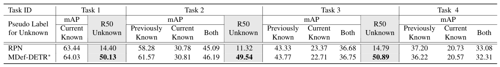

# Applications
We provide instructions to use class-agnostic object detection capability of MDef-DETR to various applications. 
Please refer to the Sec. 5 of our [paper](https://arxiv.org/abs/2111.11430) for more details.

## Open-world Object Detection
We train MDef-DETR on a filtered MDETR dataset, generated by explicitly removing all captions that contain any unknown 
category, leaving **0.76M/1.25M image-text pairs**. These filtered annotations are available at 
[this link](https://drive.google.com/drive/folders/1-3kAsyZIVFbNelRXrF93Y5tMgOypv2jV?usp=sharing).

We modify the ORE annotations using MDef-DETR proposals and then use the instructions from official 
[ORE codebase](https://github.com/JosephKJ/OWOD.git) to train ORE using MDef-DETR pseudo labels. Specifically,
1. We generated proposals on ORE data using MDef-DETR
2. Label the unknowns using MDef-DETR proposals (pleaser refer to the script 
[add_unknown_pseudo_labels.py](ORE/add_unknown_pseudo_labels.py) for details)
3. Use official [ORE codebase](https://github.com/JosephKJ/OWOD.git) for training ORE.

All of our ORE pretrained models are available at 
[this link](https://drive.google.com/drive/folders/1PMH6UeETkNPWFJTwLoY9geG10Au8y1Hl?usp=sharing).

## Pretraining for Class-aware Object Detection (DETReg)

DETReg pretrains object detector using Selective Search proposals. We show that replacing these 
noisy pseudo labels with MDef-DETR proposals can improve the downstream performance on object detection task. 
Please refer to the Sec 5.3 of our [paper](https://arxiv.org/abs/2111.11430) for details.

All the pretrained models and the ImageNet proposals are available at 
[this link](https://drive.google.com/drive/folders/1LGhpcgP9qWEfOXaDP9V2wotC5uZ57K_v?usp=sharing).

